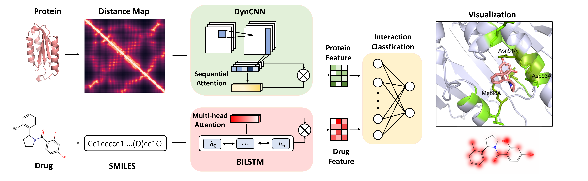

# Predicting Drug Protein Interaction using Quasi-Visual Question Answering System

Supporting Information for the paper "[Predicting Drug Protein Interaction using Quasi-Visual Question Answering System](https://www.nature.com/articles/s42256-020-0152-y)"

DrugVQA is a multimodel learning method combining a dynamic attentive convolutional neural network to learn fixed-size represen-tations from the variable-length distance maps and a self-attentional sequential model to automatically extract semantic features from the linear notations.

## Dataset
All data used in this paper are publicly available and can be accessed here: [DUD-E](http://dude.docking.org ), [BindingDB-IBM dataset](https://github.com/IBM/InterpretableDTIP), [Human dataset](https://github.com/masashitsubaki/CPI_prediction/tree/master/dataset) and [protein 3D structure](https://www.rcsb.org).

## Demo Instructions
All default arguments for demo are provided in the [dataPre.py](./dataPre.py).
Run [test.py](./test.py)

## Usage
To run the training procedure,

1. Install [requirements.txt](./requirements.txt) to set up the envirnoment.
2. Run the [test.py](./test.py) to test the model.

``python test.py --protein input1 --ligand input2``

+ input1: protein sequence or protein contact map file (file should be named like '*_contact_map')
+ input2: ligand smiles list, separated by commas

expample:
``python test.py --protein 'IMGSSVYITVELAIAVLAILGNVLVCWAVWLNSNLQNVTNYFVVSLAAADIAVGVLAIPFAITISTGFCAACHGCLFIACFVLVLTQSSIFSLLAIAIDRYIAIRIPLRYNGLVTGTRAKGIIAICWVLSFAIGLTPMLGWNNCGQSQGCGEGQVACLFEDVVPMNYMVYFNFFACVLVPLLLMLGVYLRIFLAARRQLNIFEMLRIDEGLRLKIYKDTEGYYTIGIGHLLTKSPSLNAAKSELDKAIGRNTNGVITKDEAEKLFNQDVDAAVRGILRNAKLKPVYDSLDAVRRAALINMVFQMGETGVAGFTNSLRMLQQKRWDEAAVNLAKSRWYNQTPNRAKRVITTFRTGTWDAYRSTLQKEVHAAKSLAIIVGLFALCWLPLHIINCFTFFCPDCSHAPLWLMYLAIVLSHTNSVVNPFIYAYRIREFRQTFRKIIRSHVLRQ' --ligand 'C#CCOc3nc(c1ccccc1)nc4sc2CCCc2c34,OC[C@H]3OC(n1cnc2c(NCCS(O)(=O)=O)ncnc12)[C@H](O)[C@@H]3O'``

``python test.py --protein ./3emlA_contact_map --ligand 'C#CCOc3nc(c1ccccc1)nc4sc2CCCc2c34,OC[C@H]3OC(n1cnc2c(NCCS(O)(=O)=O)ncnc12)[C@H](O)[C@@H]3O'``
